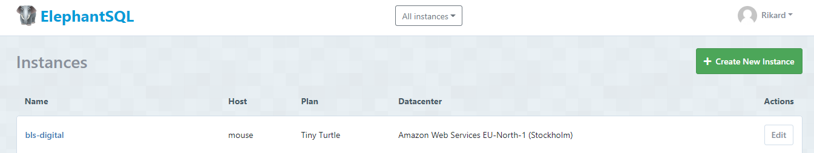
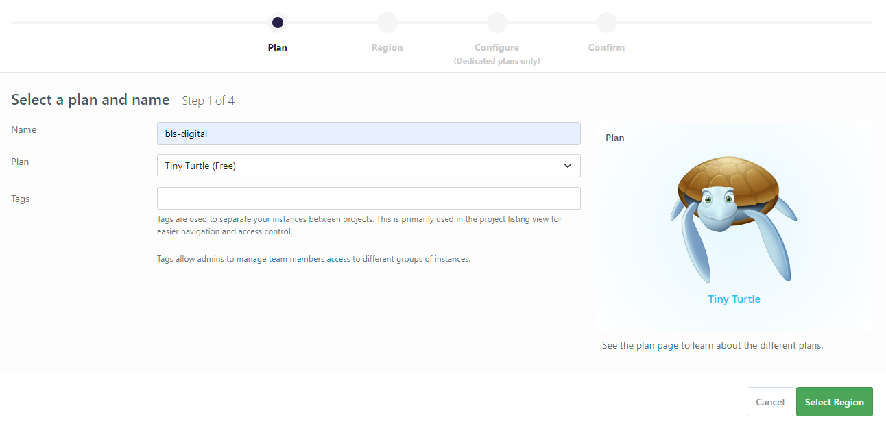
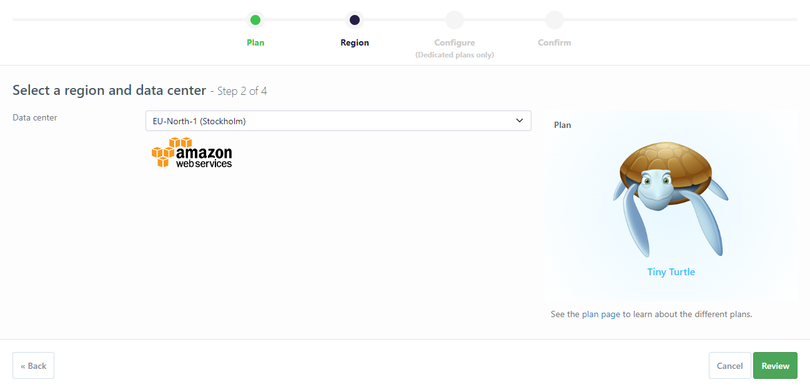
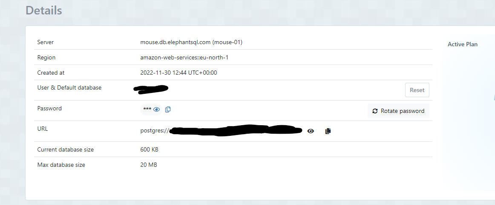
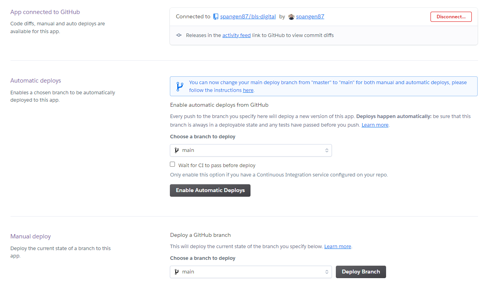

# BLS Digital
A security online store that focuses on smart digital locks for your home, rentals and small businesses.
This site does not take real orders, but a version of it probably will in the future.

Welcome to [BLS Digital](https://bls-digital.herokuapp.com/)!


## Contents
- [User Experience](#user-experience)
    - [User Stories](#user-stories)
    - [Agile Methodology](#agile-methodology)
    - [Wireframes](#wireframes)
    - [Database](#database)
    - [Design](#design)
- [Marketing](#marketing)
- [Features](#features)
    - [Existing Features](#existing-features) 
    - [Future Features](#future-features)
- [Tecnologies Used](#technologies-used)
    - [Technologies Used](#technologies-used)
    - [Libraries](#libraries)
- [Testing](#testing)
- [Bugs](#bugs)
    - [Solved](#solved)
    - [Left to Solve](#left-to-solve)
- [Deployment](#deployment)
    - [Deployment to Heroku](#deployment-to-heroku)
    - [Forking The Repository On GitHub](#forking-the-repository-on-github)
    - [How To Clone The Project](#how-to-clone-the-project)
- [Credits](#credits)
- [Acknowledgements](#acknowledgements)


## User Experience
### User Stories


[Back to top](#contents)
### Agile Methodology
#### GitHub Project Board
GitHubs Projects is used in this project to keep track of the user stories that is done, ongoing and not started yet.
It has been a big help to go there and get a overlook of what has been done and what is left when it has been tough.
When you work in a team i think this will be an even bigger help.

I also divided the work in two iterations so I could have goals that were more manageable.


[Back to top](#contents)
### Wireframes
Before i started with anything else I made some wireframes to guide me through the design decisions. There has been some changes along the way, but the base structure is still the same.


[Back to top](#contents)
### Database
For this project I used a free database called [ElephantSQL](https://www.elephantsql.com/).
More about how to set that up in the deployment section.

There is five models in the database that I have created, along with a number that comes with Django from start.
- Products. A model for all the product details needed for a product. There is also a basic stock tracking in this model.
- Category. Complements the product model and makes it possible to sort the products in to categories.
- UserProfile. Gives logged in user the possibility to save their delivery information and have it pre filled to the next time.
- Order. Stores all the order information. This is also presented to logged in user in their profile page.
- OrderLineItems. Stores the products on the order and keep track of the quantity of each product in the order.
- ProductReview. Stores reviews given by a logged in user for a specific product.
- Wishlist. A model that makes it possible for a logged in user to create their own wishlist with products. 

Some of these models are similar to the models in Boutique Ado Walkthrough Project at Code Institute. But I have made some changes to the models and added more functionality. There is also some more validation and help texts added where needed.

Note: From the standard django models included, the django_content_type and django_migrations is missing from the image below. This is due to a limit in Draw SQL for 15 tables.


[Back to top](#contents)
### Design
#### Typography
For this project I decided to stick with the standard font provided from bootstrap. I thought it looked like I wanted so there was no need to change it.

#### Colors
The colors used is combination of three main color. Two darker ones and a lighter one that is used as background on the page. I wanted a dark forest green look, so I chossed a color I liked and then used [Colormind](http://colormind.io/bootstrap/) to pick some matching colors.


[Back to top](#contents)
## Marketing
### SEO
Here I have made i list of possible keywords. The ones that liked the most is implemented in the head of the HTML in a meta tag with keywords.
The most important words are also used in the content of the pages that has content.


### E-commerce Business Model


### Newsletter
The footer of every page has a form to sign up for newsletter. It is connected to my mailchimp account where you can send custom designed emails easily and free.

### Facebook Page
A Facebook page is created for this e-commerce store. I will only provide a screenshot of it, because I will disable it so my account wont get closed for some reason.


## Features
### Existing Features For All Users
#### Navigation Bar
Here I wanted clear and simplistic look. A small logo to the left followed by some menu links. Products and Account have dropdowns for further menu choices.
To the right there is a search bar, followed by a link to the shopping bag. The shopping bag have a badge the quantity of products in the shopping bag. Below that there is a summary of the total amount in the shopping bag.

The search bar searches in the product name and in the description. With this amount of products it is not absolutely necessary, but it is a nice feature to have if there are more products added to the shop. 


[Back to top](#contents)
#### Home
When visiting the home page I wanted something clean but at the same time something that could sell. So i decided to go with a slideshow at the top with three pictures rotating. A mix of environment pictures and a made up "mechanical lock" that looks digital. Each slide have a diffrent quote with a link to the shop beneath. The quotes are hidden on smaller screens because it would not look good.

Beneath the slides there is three headings with icons. They have some short USPs and link to read more or to enter the shop.

Without scrolling further you get a picture of what the store sells and what kind of products that is offered.


If you scroll down the page there is a nice picture of one of products on a door. It give a little bit of a luxury feeling around the product. To the left of the image there is a heading in two colors that shows that the product is available in two colors.


[Back to top](#contents)
#### Footer
The footer have a copyright, a small logo and a form to subscribe to the newsletter. The newsletter form is connected to my mailchimp so emails entered there will be saved. 


[Back to top](#contents)
#### Products
The products are divided in to three columns. Showing the picture, price, category, name and a link to the details page. It is possible to sort by name, category or price. There is not much use for this now, but it makes the shop future prof if there are more products added. There is also a pagination if there is more than six products.


[Back to top](#contents)
#### Product Detail
This page shows a picture of the product, description, name, category and price. Then there is a option to choose quantity before adding it to the shopping bag. There is also a link back to the product list. Beneath that there the possibility to log in to add or remove the product from the wishlist. And below that the reviews of the product is showing. If you are logged in you can add a review. Above the buttons there is a colored text that shows the stock status. If it is more than five items in stock it will be green and show "In Stock". Is it less than five it will be orange and say "Few left: (quantity left)". If it is out of stock it will say "Out of Stock" in red text and the add to bag button will be disabled.

I have also added a link to the product manual in PDF if available. Otherwise it will be a external link to the manufacturers website. The weight of the product and origin is shown if there is such information about the product.


[Back to top](#contents)
#### Why Smart Locks?
This page gives some further information about smart locks and their benefits with a link to the contact page if there is some questions.
In a real business I think it should be a bigger page with more unique selling points and more information.


[Back to top](#contents)
#### Contact
This page has a contact form that will send an email to the store owner. When submitted succesfully a message will show that confirms that mail have been sent.


[Back to top](#contents)
#### Sign In
The sign in page is a standard page from allauth with some styling added to it.


[Back to top](#contents)
#### Sign Up
The sign up page have the same styling as the sign in page. The email confirmation is active so the user would need to enter a real email address. The form checks that the password is long enough and not too common. The username and email also has to be unique.


[Back to top](#contents)
#### Toasts
When adding a product to the shopping bag a message will show in the top right corner. This message is from bootstrap and is called a toast. If there is a error or other success message it will also show there, but without the shopping bag summary. This is so the user always knows what is happening.


[Back to top](#contents)
#### Shopping Bag
The shopping bag is displayed with a card for each product that includes the necessary information. There is also links to update the quantity of a product, and to remove it from the shopping bag. At the bottom there is summary of all the costs, followed by a button for checkout, and a button to return to the shop.


[Back to top](#contents)
#### Checkout
This page has a form with all the necessary fields to handle the order. The phone number field has some added validation so the user needs to enter it beginning with a country code. The required fields are marked with a star. And all required fields have regex validation added to them. Below these fields there is a checkbox to save the information to your profile if you are logged in. The card field is from [Stripe](https://stripe.com/).
To the right of the form there is a summary of what the order contains. At the bottom there is a button to complete the order or to go back to the shop. There is also a summary shown how much the card will be charged.


[Back to top](#contents)
#### Checkout Success
This page shows that order was created successfully with a summary of the order. A toast also appears telling it was successfull. An email is sent out to the user with a confirmation, and also an email to the store owner notifying there is a new order to handle. 


[Back to top](#contents)
### Existing Features For Logged In User
#### My Profile
As a logged in regular user you have the ability to edit your default shipping details and to view your order history.
You can also click the link on the order to view the complete order confirmation. A toast will then tell it's a historic order confirmation and not a new one.


[Back to top](#contents)
#### Wishlist
When logged in you can access your wishlist under "Account". Here you can see what products you have in your wishlist, visit them, or remove them from your list.


[Back to top](#contents)
### Existing Features For Store Owners
#### Add, delete and edit products
When you are logged in as a store owner (superuser) you have the ability to add new products to the store from the front end, edit existing products and deleting products.


On the product page you have two new links. One for editing the product, and one for deleting. If you delete a product a alert will show and you have to confirm.


Same function as above on the product detail page.


When you click on account as a store owner you have an additional option, Manage Products. That will lead to this form for adding a new product to the store.

[Back to top](#contents)
#### Mark Order As Shipped
When logged in to the admin panel I have added a boolean field "Order shipped". This will make it easier as a store owner to keep track of which order that is left to handle.


[Back to top](#contents)
### Future Features
- Add discount cuopons would be a nice feature to have in the future.
- Handling of the stock would be needed for live use of the store.
- FAQ page to avoid unecessary emails with questions.
- Privacy policy would be needed for the shop to be live.
- Reviews and rating would be a nice feature to add in the future.
- Add more payment options.
- Logging in with social media accounts.

[Back to top](#contents)
## Technologies Used
- [Django](https://www.djangoproject.com/) - A model-view-template framework used to create Locksmith Booking
- [Bootstrap](https://getbootstrap.com/) - A CSS framework used for the front end development.
- [HTML5](https://en.wikipedia.org/wiki/HTML) - Provides the content and structure for the website.
- [CSS3](https://en.wikipedia.org/wiki/CSS) - Provides the styling for the website.
- [JavaScript](https://en.wikipedia.org/wiki/JavaScript) - Provides interactive elements of the website
- [Python](https://en.wikipedia.org/wiki/Python_(programming_language)) - Provides the functionality of the website.
- [a11y](https://color.a11y.com/Contrast/) - Used to test the contrast and accessibility.
- [Gitpod](https://gitpod.io/) - Used to create and edit the website.
- [GitHub](https://github.com/) - Used to host the repository.
- [GitBash](https://en.wikipedia.org/wiki/Bash_(Unix_shell)) - Terminal used to push changes to the GitHub repository.
- [Google Chrome DevTools](https://developer.chrome.com/docs/devtools/) - Used to test responsiveness and debug.
- [Balsamiq](https://balsamiq.com/) - Used to create the wireframes for the project.
- [Amazon AWS](https://aws.amazon.com/) - Used to host all static files and images.
- [Heroku](https://dashboard.heroku.com) - Used to deploy the website.
- [PEP8 Validation](http://pep8online.com/) - Used to validate Python code.
- [HTML Validation](https://validator.w3.org/) - Used to validate HTML code.
- [CSS Validation](https://jigsaw.w3.org/css-validator/) - Used to validate CSS code.
- [JSHint Validation](https://jshint.com/) - Used to validate JavaScript code.
- [drawSQL](https://drawsql.app/) - Used to draw the database schema.
- [Colormind](http://colormind.io/bootstrap/) - Used to chose colors.
- [ElephantSQL](https://www.elephantsql.com/) - Database used in the project.

[Back to top](#contents)
### Libraries
The following libraries are used in the project and are located in the requirements.txt file.


[Back to top](#contents)
## Testing
### Validator Testing
BLS Digital have been tested by using validation tools for HTML, CSS, JavaScript and Python.
- [W3C HTML Validator](https://validator.w3.org/)
- [W3C CSS Validator](https://jigsaw.w3.org/css-validator/)
- [JSHint JavaScript Validator](https://jshint.com/)

#### HTML Validation
The validations shows no error, but a couple of warnings. I chose to ignore them because the type="text/javascript" attribute is used through the education.
All pages are tested but with the same result, so I decided to only have one screenshot.


#### CSS Validation
No errors showed in the CSS validation. Here I copied the CSS in to the validator. If I put in the link it showed alot of warnings and errors because of Bootstraps CSS.


#### JavaScript Validation
The validation says it has one undefined variable, Stripe. But that comes from another script. Besides that there is no errors or warnings.


#### Python Validation
There was some warnings about too long lines, and a couple of typos that is now taken care of. I'm not sure how show this in the best way, but the warnings that is left is in files that I have not created myself.


[Back to top](#contents)
### Lighthouse Testing
The application has been tested with Chrome Dev Tools Lighthouse Testing which tests the application for:
- Performance
- Accessibility
- Best Practices
- SEO

#### Home page


Home page on desktop. This looks good and I have no comments to add.


Performance a little lower on mobile devices as expected.

#### Product Page


There is alot of pictures to render on this page so it is expected to have a little longer loading time. The reason for the lower SEO score is that all the product cards have the same link "Read More".


The same nreasons here as above.

The other pages are showing similar results as the home page, or better performance in most cases. I chose to show these two pages because they are the heaviest ones.

[Back to top](#contents)
### Accessibility Testing
I checked so the contrast was enough on the site using [a11y](https://color.a11y.com/Contrast/).

There was was one issue, which I ignored. That because it is a decorative text that has no important information. The purpose of that text is to show that the locks comes in two colors.

The color combinations used through the site in text, buttons and background has no issues.


[Back to top](#contents)
### Responsiveness Testing
Test for responsiveness was made with [Google Chrome DevTools](https://developer.chrome.com/docs/devtools/).

This has been tested through the development on smaller devices to make sure it looks good. For the most part it looks good and works as it should, but there is room for improvement in the header section on mobile devices. 

[Back to top](#contents)
### Browser Testing
Browser testing has been done manually. 

Desktop:
- Chrome: Used in development, no known issues.
- Firefox: No known issues.
- Edge: No known issues.

Mobile:
- Chrome: No known issues.
- Safari: No known issues.

[Back to top](#contents)
### Manual testing
A lot of testing has been done throughout the development. Here follows a summary of all the tested functionality.

[Back to top](#contents)
#### Home
##### Expected
All links should work. And the search bar accessed in the navbar should work and give a message if you try without entering any characters. The sign up form for newsletter in the footer should work, and should not submit if it is something other than an email enetred.

##### Outcome
- All links works as expected.
- Newsletter form only accepts a submit when it is a email.
- Empty search gives a error message.


[Back to top](#contents)
#### Products
##### Expected
- All products shows.
- Sorting works.
- All links works properly.
- Product cards are showing the expected information.
- Pagination functionality.

##### Outcome
- All products displays as expected, with the information it should.
- All the links works as expected.
- Sorting works.
- Pagination works properly when all products are shown, but not when you are sorting products or showing a search result. This will be a wont fix at the moment. The pagination is just there for future use, and is not necessary with this amount of products.

[Back to top](#contents)
#### Product Detail
##### Expected
- Information is rendering properly.
- All links works.
- Add to shopping bag function works, and the quantity picker adds the correct quantity to the shopping bag.

##### Outcome
- Information is showing as expected.
- All links works.
- Add to shopping bag work, and the correct quantity is added.
- If you enter a invalid number manually in the quantity field the validation works and will not add it to the shopping bag.


[Back to top](#contents)
#### Why Smart Locks?
##### Expected
- Links should work and pictures should show properly.

##### Outcome
- Everything works as expexted.

[Back to top](#contents)
#### Contact
##### Expected
- The form should submit and send an email to the store owner.
- The form should only submit if it is filled out with valid information.

##### Outcome
- The form sends an email including the name, email and the message.
- The validation works. See pictures below.


[Back to top](#contents)
#### Shopping Bag
##### Expected
- Information and pictures shows properly.
- You can change quantity in the bag of a product and validation works.
- Calculations are correct.
- Links works.

##### Outcome
- Everything renders as it should.
- Calculations are correct and adds the correct delivery cost if any.
- Links works.
- Quantity can be changed with no issues. If you enter an invalid quantity, for example 3,5, an error will show. See picture below.


[Back to top](#contents)
#### Checkout
##### Expected
- Show a correct order summary.
- All form fields works properly. And the required fields are marked with a star.
- The card field from Stripe works and gives error messages when card details are not correct.
- The form does not submit and does not throw an error 500 when there is invalid information.
- After successfull order you are redirected to order success page.

##### Outcome
- Order summary shows properly.
- All fields works as expected.
- The card field works as expected and gives error messages when needed. See picture as example.


- When the other form fields are invalid, an other message is shown. See picture below.


- After successfull checkout you are redirected to the success page. Picture below. An email confirmation is also sent to customer as expected, and also a notification email to the store owner.


[Back to top](#contents)
#### My Profile
##### Expected
- Render the form and show the order history correctly.
- Form have same fields as in the checkout and validation works.
- Update of information works and links on order history works.

##### Outcome
- The form and order history shows the correct information. It works to save the information from the checkout page when you are logged in, and also pre fill the form if you have saved details in the profile already.
- Update information works as expected and gives a message that it is updated. Order history links works for showing the complete order, with a message notifying it is not a new order. See pictures below.


- Validation on form fields works as it should. See picture below.


[Back to top](#contents)
#### Manage Products
##### Expected
- Page only accesible for superusers.
- You can add a product with image.
- Price can not be 0 or negative.
- SKU must be unique.

##### Outcome
- Page is only accessible for superusers. When not, you are redirected to the sign in page.


- Adding a product with image works as it should.
- Validation of price and unique SKU works as it should.


[Back to top](#contents)
## Bugs
### Solved
- When clicking on a category link under products, the products in that category won't show.
I solved this one by adding a split by "," to the category in the views.

- Submitting checkout form without country code on the phone number throws an error instead of a message.
This took me several hours, including a couple with tutor support. In the end it was an easy fix. It was a block that was indented wrong and inside an if-statement.

- Delivery costs become 34$ instead of 5$ after checkout.
I had made a mistake in the calculation of the grand total. It was total + total + delivery. The issue were fixed by removing one of the totals.

[Back to top](#contents)
### Left to Solve
There is no known bugs left to solve.

[Back to top](#contents)
## Deployment
### Deployment to Heroku
This application is deployed using [Heroku](https://heroku.com/).

- Before doing the following steps I created a env.py file in gitpod that contains the sensitive information that should not be pushed to github/heroku. And added that file to the .gitignore file.
- Created a Procfile so Heroku knows what kind of application it is.
- Created a requirements.txt file with all the necessary requirements for the app to run.

The steps for deploying through [Heroku](https://heroku.com/) is as follows:

1. Visit [Heroku](https://heroku.com/) and make sure you are logged in.
2. Click on New and then choose New App.
3. Choose a name for your app and then choose your region.
4. Then press 'Create app'.

#### Attach The Database
1. Log in or sign up to [ElephantSQL](https://www.elephantsql.com/).
2. Press create new instance.



3. Choose a name and plan. Then click on select region.



4. Select the data center that is closest to you and press review.



5. Then just click on "Create Instance".
6. Go back to the start page and click on your new database.
7. Copy the URL for the database.



8. Back in [Heroku](https://heroku.com/) click on the settings tab of your application.
9. Click on "Reveal config vars".
10. Add a new config var named DATABASE_URL and paste in the URL from [ElephantSQL](https://www.elephantsql.com/) as the value.
11. Go back to Gitpod or other IDE and install two more requirements for the database:
    - `pip3 install dj_databse_url`
    - `pip3 install psycopg2-binary`
12. Update your requirements.txt file by typing in `pip3 freeze --local > requirements.txt`
13. Add the DATABASE_URL to your env.py file.
14. Go to settings.py and `import dj_database_url`
15. Comment out the default `DATABASES` setting.
16. Add this under the commented out section:

    ```
    DATABASES = {
        'default': dj_database_url.parse(os.environ.get('DATABASE_URL'))
    }
    ```
17. Run migrations for the new database.

#### Continue Deployment to Heroku
1. Create a file in the base directory called "Procfile" and add `web: gunicorn project_name.wsgi` so Heroku will know what kind of application it is.
2. In settings.py add ['app_name.heroku.com', 'localhost'] to `ALLOWED_HOSTS`.
3. Commit and push these changes to GitHub.

4. Back in the Heroku settings tab update the config vars:
    |     Variable name     |                           Value/where to find value                           |
    |:---------------------:|:-----------------------------------------------------------------------------:|
    | AWS_ACCESS_KEY_ID     | AWS CSV file                                                                  |
    | AWS_SECRET_ACCESS_KEY | AWS CSV file                                                                  |
    | DATABASE_URL          | In your ElephantSQL dashboard                                                 |
    | EMAIL_HOST_PASS       | Password from email client                                                    |
    | EMAIL_HOST_USER       | Email address                                                                 |
    | SECRET_KEY            | Random key generated with [Djecrety](https://djecrety.ir/)                    |
    | STRIPE_PUBLIC_KEY     | Stripe Dashboard > Developers tab > API Keys > Publishable key                |
    | STRIPE_SECRET_KEY     | Stripe Dashboard > Developers tab > API Keys > Secret key                     |
    | STRIPE_WH_SECRET      | Stripe Dashboard > Developers tab > Webhooks > site endpoint > Signing secret |
    | USE_AWS               | True                                                                          |

If you do this in the beginning of the project you will also need `DISABLE_COLLCETSTATIC` set to 1. When you have some staticfiles ready you can then remove this variable.

5. If this is at the end of the project make sure `DEBUG` is set to `False` in settings.py.
6. Go to the "Deploy" tab in Heroku and connect your GitHub account.
7. Search for your repository and connect it.
8. At the bottom of the page click "Deploy Branch".



9. You are now ready and can click "Open App" to see the live deployed version.


[Back to top](#contents)
### Forking the repository on GitHub
A copy of the repository can be made. This copy can be viewed and changed on another account without affecting the original repository.

The steps for doing this:
1. Make sure you are logged in on GitHub and then find the repository.
2. On the top right there is a button called Fork.
3. Press the Fork button to make a copy to your account.


[Back to top](#contents)
### How to clone the project
This is how you make a clone of the repository:

1. Click on the code tab under the repository name.
2. Then click on "Code" button to the right above the files listed.
3. Click on the clipboard icon to copy the URL.


4. Open Git Bash in the IDE of your choice.
5. Change the working directory to where you want your cloned directory.
6. Type `git clone` and then paste the URL that you copied.
7. Press enter and clone has been finished.

- Now it is time to install project requirements needed to run the project. In the terminal, type the following command: 
    - ```pip3 install -r requirements.txt```<br/>

- This will download all the necessary dependencies stated in the requirements.txt file which will enable the project to work.

- Now we create our env.py file which tells our project which variables to use. These variables are usually hidden for security purposes so make sure to not publicly share your .env file. Add the file to a .gitignore so it does not appear on github if you are using that.

- Type the command ```python manage.py makemigrations``` followed by ```python manage.py migrate```. This will apply all the migrations necessary for the project to work.

- After all the migrations have been successfully made, type the command ```python manage.py runserver```.

- This will launch the project locally and is ready for development.

[Back to top](#contents)
## Credits
### Content
- [Bootstrap](https://getbootstrap.com/) is used alot in this project when adding the design to the front end.
- Boutique Ado Walktrhrough from [Code Institute](https://codeinstitute.net/). Alot that we did in the walkthrough are also in this project with some changes when needed.
- The slideshow and base structure for the home page comes from [Bootstrap Examples](https://getbootstrap.com/docs/5.0/examples/).

[Back to top](#contents)
### Media
- Images and product description comes from [tedee](https://tedee.com/).
- Images were compressed using [TinyJPG](https://tinyjpg.com/).
- The images that I have edited were done in [Adobe Photoshop](https://www.adobe.com/se/products/photoshop.html?tt=emea1224).

[Back to top](#contents)
## Acknowledgements
This project was made as Portfolio Project 5 in the Full Stack Software Deevelopment education from [Code Institute](https://codeinstitute.net/).
I would like to thank my mentor [Precious Ijege](https://www.linkedin.com/in/precious-ijege-908a00168/), tutors from Tutor Support, the slack community at [Code Institute](https://codeinstitute.net/) for the help and support during this project. I also would like to thank my colleagues Daniel and Järker at [Best Las](https://bestlas.se/) for giving me the opportunity and time to do this education. It has been more intense then I could imagine, but also more fun and rewarding!

Rikard Spångmyr, 2023.
[Back to top](#contents)